# columns

```
	data: {
		columns: [
			[null, 'Apples', 'Pears', 'Oranges'], // categories
			['Ola', 1, 4, 3], // first series
			['Kari', 5, 4, 2] // second series
		]
	}
```

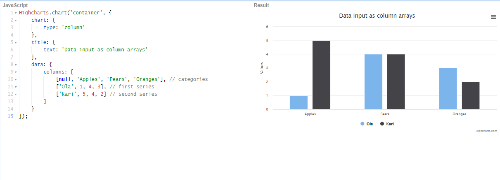

 https://jshare.com.cn/github/highcharts/highcharts/tree/master/samples/highcharts/data/columns/ 

#  **columnsURL** 

```
data: {
		csvURL: 'https://demo-live-data.highcharts.com/vs-load.csv',
		enablePolling: true,
		dataRefreshRate: 1
	}
```

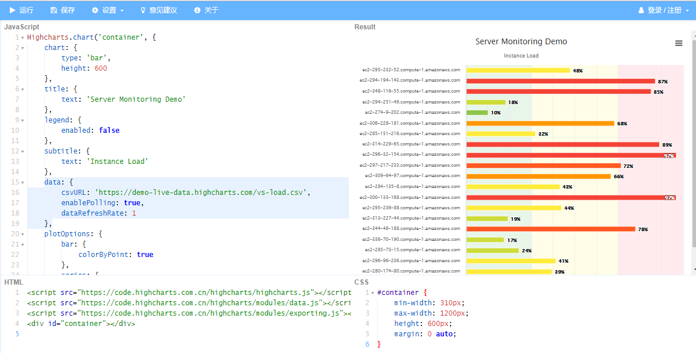

 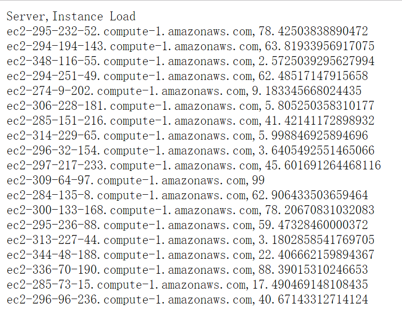

https://jshare.com.cn/github/highcharts/highcharts/tree/master/samples/highcharts/data/livedata-columns 

# csv

```
data: {
		csv: document.getElementById('csv').innerHTML
	}
```

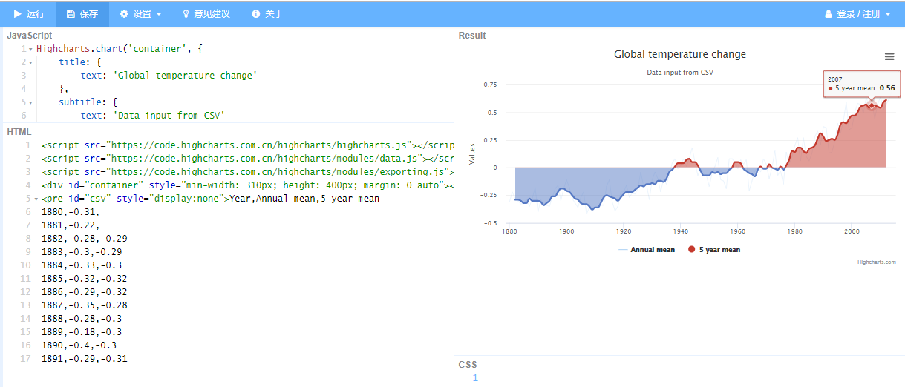

 https://jshare.com.cn/github/highcharts/highcharts/tree/master/samples/highcharts/data/csv/ 

#  **csvURL** 

```
data: {
		csvURL: 'https://demo-live-data.highcharts.com/time-data.csv',
		enablePolling: true
	}
```

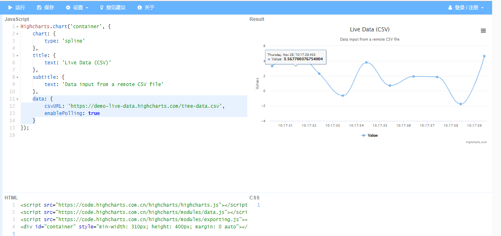

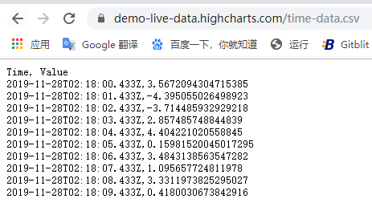

 https://jshare.com.cn/github/highcharts/highcharts/tree/master/samples/highcharts/data/livedata-csv 

# rows

```
data: {
		rows: [
			[null, '小明', '小红'],  // 第一行为数据列的名字
			['苹果', 1, 5], 		  // 分类及数值
			['梨', 4, 4], 		   // 分类及数值
			['橙子', 3, 2] 		  // 分类及数值
		]
	}
```

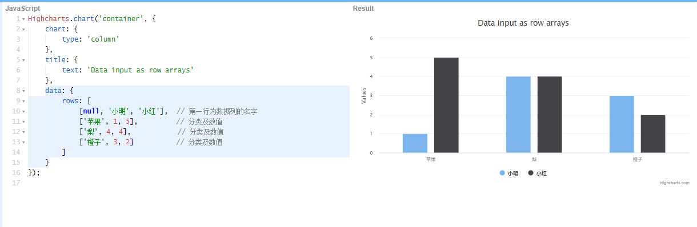

 https://jshare.com.cn/highcharts/d5J8om 

# rowsURL

```
data: {
		rowsURL: 'https://demo-live-data.highcharts.com/time-rows.json',
		firstRowAsNames: false,
		enablePolling: true
	}
```

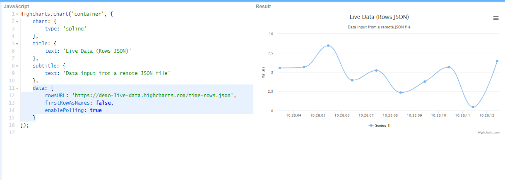

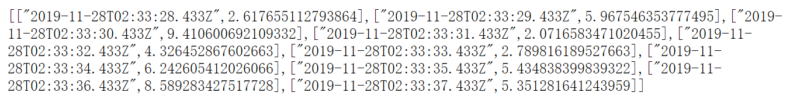

 https://jshare.com.cn/github/highcharts/highcharts/tree/master/samples/highcharts/data/livedata-rows 

# table

```
data: {
		table: 'datatable'
},
```

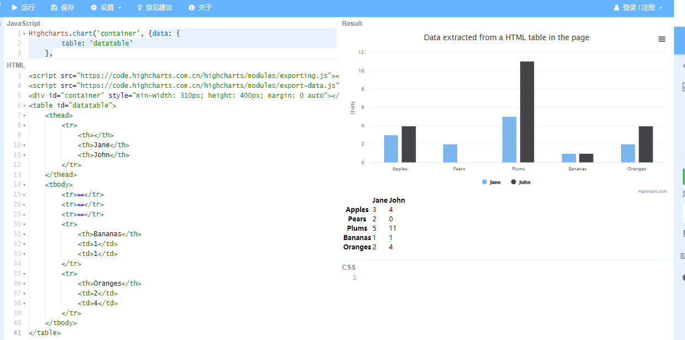

 https://jshare.com.cn/github/highcharts/highcharts/tree/master/samples/highcharts/demo/column-parsed/ 


## 通过远程JSON数据集的URL获取数据，并生成图表，数据结构为行数组

```
data: {
		rowsURL: 'https://demo-live-data.highcharts.com/time-rows.json',
		firstRowAsNames: false,
		enablePolling: true
	}
```

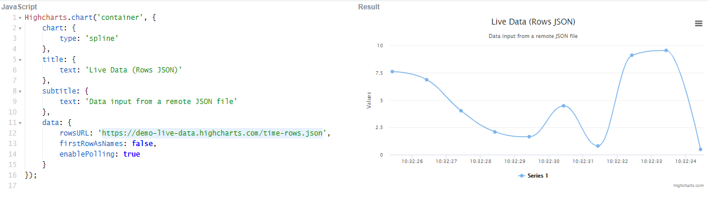


 https://jshare.com.cn/github/highcharts/highcharts/tree/master/samples/highcharts/data/livedata-rows 